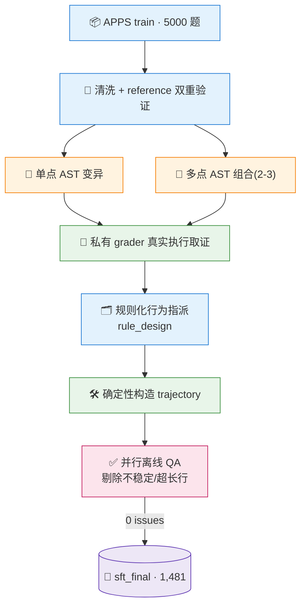
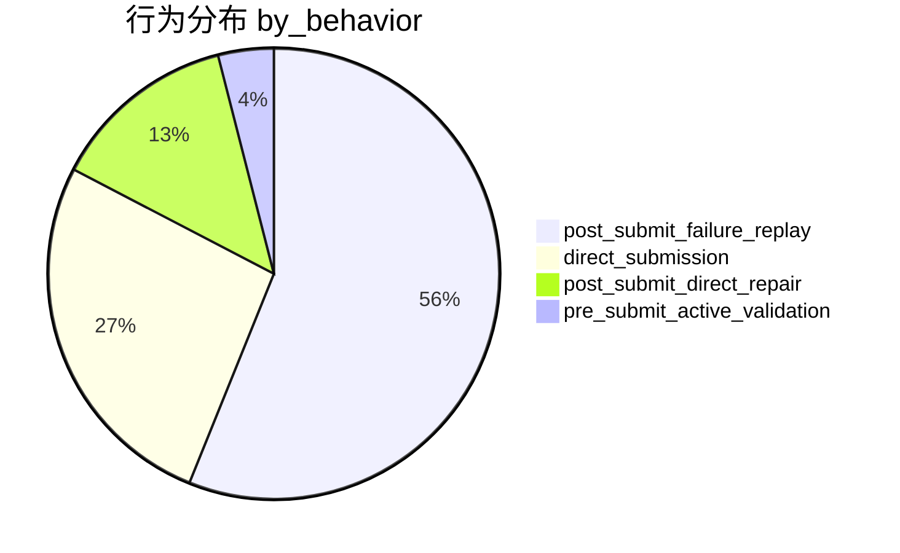
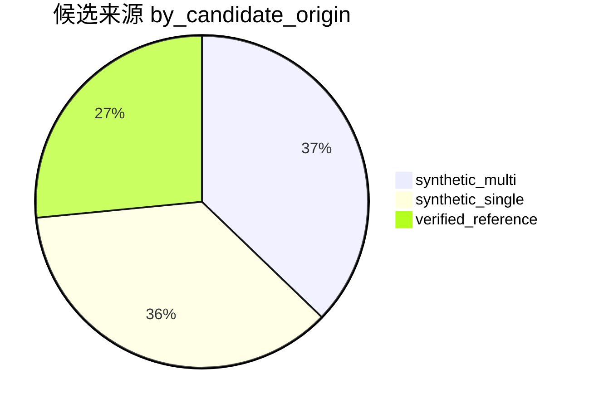
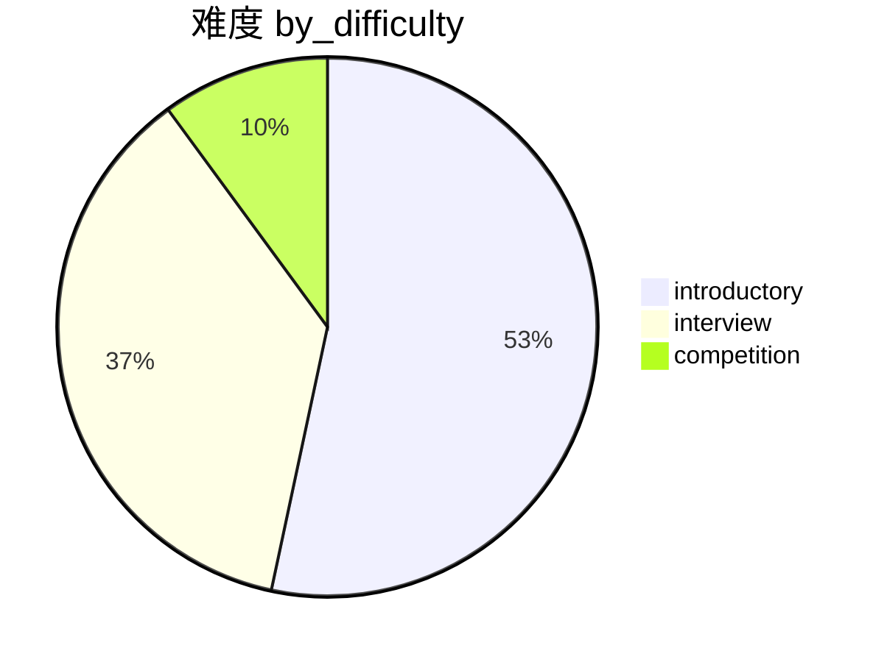
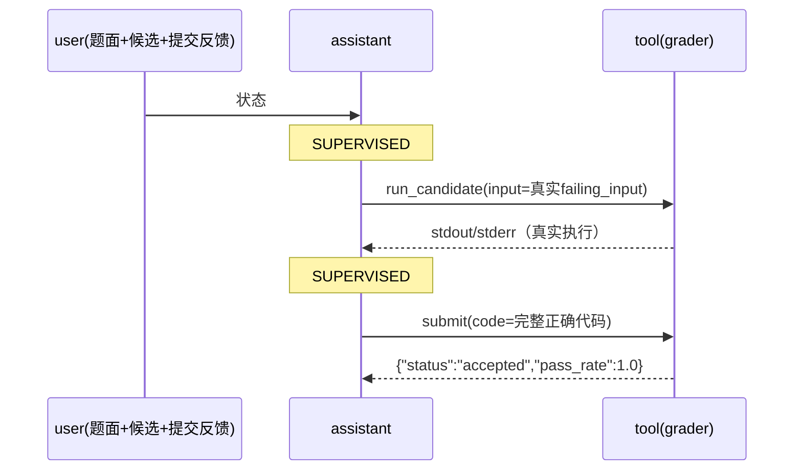

<div align="center">

# 🧪 ToolAPPS

**ToolAPPS：面向编码智能体工具使用训练的确定性合成、执行可验证轨迹数据集**

*A Deterministic, Execution-Verified Trajectory Dataset for Tool-Use Coding Agents*


> **TL;DR** —— 一条样本 = 「可观察状态 → 在真实执行验证下该调用的工具动作」。数据集完全离线生成：人工注入的可控错误 + 私有 grader 真实取证 + 确定性恢复正确解。不烧模型、不调 API、行为标签是规则设计而非经验反事实。

</div>

---

## 📑 目录

| | | |
|---|---|---|
| [📖 摘要 Abstract](#-摘要-abstract) | [🎯 引言：为什么是“规则化”](#-引言为什么是规则化) | [🧩 任务形式化](#-任务形式化) |
| [⚙️ 合成方法](#️-合成方法) | [📊 数据集](#-数据集) | [✅ 质量控制](#-质量控制) |
| [💬 讨论与局限性](#-讨论与局限性) | [🔗 相关工作](#-相关工作) | [🔄 可复现性](#-可复现性) |
| [📜 引用](#-引用) | [🧾 附录](#-附录) | |

---

## 📖 摘要 Abstract

编码智能体的监督微调（SFT）需要“**可验证**的状态 → 动作”对：模型应当学会在什么状态下调用 `run_candidate(input)` 观察程序行为、在什么状态下直接 `submit(code)`。主流的模型 rollout 合成方式昂贵、随机且不稳定，而合成器手中**本就握有正确答案**——既然错误是我们注入的，理想的“逆向调试”轨迹就是可计算的。

**ToolAPPS** 提供三条核心贡献：

- ✅ **全规则化确定性合成**：候选程序来自对双重验证 reference 的 AST 变异（单点/多点），行为由规则指派（`label_method=rule_design`），全程无模型、无 API、固定 seed、可断点复现；
- ✅ **真实执行接地**：每一条 `submit` 反馈与 `run_candidate` 观测均由私有 grader 在沙箱中真实产生，最终提交全部 100% 通过并经离线并行重放复验（QA **0 issues**）；
- ✅ **双形态交付**：SFT 训练主集 **1,481 条 episode**（一题一条、id=原始题号）+ RL 环境包 **3,114 道题**（public/private 严格隔离）。

> ⚠️ **透明声明**：ToolAPPS 的轨迹行为为**规则设计产物**，不包含、也不声称经验反事实测量（即未用真实策略在 k 次采样下比较有无执行的分支成功率）。

---

## 🎯 引言：为什么是“规则化”

要让模型学会“何时该用工具”，我们需要的不是自然语言示例，而是 **{状态, 依据证据的动作}** 的对。此前经验式路线的关键难点在于：行为标签需要通过真实模型在配对反事实实验下的成败率来判定（HIGH/LOW/utility 阈值），而这带来三重代价：

1. **成本**：每个候选 × k 个 seed × 双分支的模型调用，昂贵且不可复现；
2. **不稳定**：外部 API 的可用性、版本浮动与生成方差都会污染流水线（早期试运行多次在“无 reasoning 端点”“偶发 provider 错误”上整体失败）；
3. **口径漂移**：当“修复”本身要交给模型时，数据质量与模型能力耦合。

**关键观察**：在我们自己构造的错误（AST 变异）面前，正确答案始终在手。模拟一个 agent 从错误逆向调试回正确解时，每一步的证据——哪个输入会失败、失败程序实际输出什么、最终完整正确代码是什么——全部可以由**私有 grader 真实计算**，而非由模型猜测。因此本数据集采用确定性规则化合成，把「调试过程演示」变成一条可审计、可重放、可无限复现的装配线。

### 设计原则

| # | 原则 | 含义 |
|---|---|---|
| 1 | 🔒 错误代码只做上下文 | 任何失败提交永不作训练目标，`labels = -100` |
| 2 | 🧭 观测只来自真实执行 | failing input、pass_rate、stdout/stderr 全部由 grader 产出 |
| 3 | 🕳️ 信息边界 | expected / reference / mutation 元数据永不进入模型可见内容 |
| 4 | 🆔 一题一条、原始 id | 样本 `id` 即 APPS 原始题号，无前缀、无合成类型 |
| 5 | 🧮 不伪造统计 | 行为由规则指派即如实标注，不以“经验测量”冒充 |

---

## 🧩 任务形式化

### 工具契约

| 工具 | 参数 | 语义 |
|---|---|---|
| 🔨 `run_candidate(input)` | `input: string` | 运行**当前候选程序**于该输入，返回可观测执行结果 |
| 📤 `submit(code)` | `code: string` | 向私有 grader 提交完整代码，返回公开投影反馈 |

`submit` 公开反馈只含 `{status, passed, total, pass_rate, failing_input}`；不返回 expected / actual / test index / reference。

### 四种行为（完整名称）

| 行为 | 模型可见上下文 | 监督目标动作 |
|---|---|---|
| `post_submit_direct_repair` | 题面 + 失败候选 + 提交反馈 | `submit(修复后完整代码)` |
| `post_submit_failure_replay` | 同上 | `run_candidate(原样 failing_input)` → `submit(完整代码)` |
| `pre_submit_active_validation` | 题面 + 候选（**无任何 grader 反馈**） | `run_candidate(规则构造探测输入)` → `submit(完整代码)` |
| `direct_submission` | 题面 | `submit(双重验证可靠代码)` |

> ⚠️ **信息边界红线**：`pre_submit_active_validation` 的探测输入由规则构造器生成，来源为公开上下文 + 规则探测，**绝不从 hidden tests 中挑选**；`expected/reference/mutation` 相关内部字段会被 QA 全量扫描拦截。

---

## ⚙️ 合成方法

### 流水线总览



### 三步构造要点

**① 变异（错误注入）** —— 输入只能是双验证 reference，产出是稳定局部失败的候选：
- 单点：恰好 1 个受支持语义编辑（comparator / arithmetic / boolean / boundary / range / index / initialization / aggregation / loop / return / I-O），重放失败签名一致；
- 多点：基于兼容图自动组合 2–3 个编辑，并要求 `individual-harmfulness` + `survivor check`（修复任一错误后仍失败），保证“多轮修复”演示真实成立。

**② 执行取证（证据）** —— 所有 `run_candidate` 输出与 `submit` 反馈均由 `SandboxedExecutor → PrivateGrader` 实际运行得到；`failing_input` 就是反馈里的那一个，不做任何注入。

**③ 指派与装配（标签）** —— 行为由确定性规则按来源与候选能力指派（supply-driven），轨迹消息按统一 schema 组装，标注逐条 `trainable`。

### 与模型 rollout 的对比

| 维度 | 模型 rollout（经验式） | **ToolAPPS（规则化）** |
|---|---|---|
| 行为标签来源 | 真实模型配对反事实采样 | 规则设计（如实标注） |
| 硬件/API 依赖 | GPU 或 provider API | **无** |
| 复现性 | 依赖模型版本/温度 | 固定 seed + 断点续跑 + 原子写 |
| 中间失败提交 | 靠模型自然产生 | 由 mutation 结构确定构造（保证仍失败） |

---

## 📊 数据集

### 主集事实卡（`data/sft_final/`）

| 指标 | 数值 |
|---|---|
| 🧾 episode 数 | **1,481**（QA 后） |
| 🆔 id 规范 | 原始题号、纯数字、**全局唯一**、一题一条 |
| ✅ 离线 QA | **0 issues**（并行重放） |
| 📏 token 长度 | 全部 ≤ 32,768（Qwen 词表） |
| 🔄 生成时间 | 单机并行清洗 + 增量装配（可断点续跑） |

**行为分布（样本 = 规则指派，非配额强凑）**



**来源分布**



**难度分布**



### RL 环境包（`data/rl/`）

| 模块 | 内容 | 数量 |
|---|---|---|
| `public/problems.jsonl` | 模型可见字段（题面/starter/io 说明） | 3,114 |
| `private/tests.jsonl` | reward 用输入输出（**禁止进上下文**） | 3,114 |
| `private/references.jsonl` | 审计用 reference | 3,114 |

难度：introductory 1,677 / interview 1,184 / competition 253；I/O：stdin 1,215 / call 1,899。

### 轨迹样例（真实数据，截断）



**loss-mask 语义**：assistant 的合法工具调用计算 loss；`tool` 响应全部 `labels=-100` 但保留 `attention_mask=1`（上下文可见、不可伪造）；失败中间提交整段 mask。

---

## ✅ 质量控制

| 检查项 | 方法 | 现状 |
|---|---|---|
| 工具契约 | schema 精确比对 | ✅ 0 违规 |
| 真实重放 | 每条 episode 并行离线重放（submit/run 全量重跑） | ✅ 0 不稳定 |
| 最终正确性 | 最终提交双重 grader + replay | ✅ 100% |
| 泄漏扫描 | 内部字段/expected/reference 关键字扫描 | ✅ 0 命中 |
| loss-mask | 解码监督 span 人工可读校验 | ✅ 通过 |
| 去重/污染 | id 唯一、题号互斥、test split 永不参与 | ✅ 通过 |

> 🧹 **剔除再复检**：重放中发现的不稳定候选（例如非确定性输出）会被自动剔除并再次全量复检，直至稳定。

---

## 💬 讨论与局限性

- 📉 **难度供给上限**：全量 train 5,000 题中通过清洗与变异验证的可用题约 **1,554**；在“一题一条”约束下，主集规模以可用题数为上界（competition 相对稀缺：149/1481）。
- 📉 **行为分布不均**：`active_validation` 依赖规则构造的判别性探测输入，在复杂输入上命中率有限，故该行为占比最低——这不是标签偏好，而是可构造性边界。
- 🧭 **规则化 ≠ 经验式**：ToolAPPS 教的是“在证据下的理想演示”；若要估计真实策略在给定状态下“运行是否必要”，需启用保留的 `empirical_counterfactual` 路径（代码保留，未启用）。
- 🎨 **风格多样性**：修复目标为 verified reference，风格偏单一；如需更多样正确解，可后续叠加自然候选采集。

---

## 🔗 相关工作

| 工作 | 方向 | 与 ToolAPPS 的差异 |
|---|---|---|
| **APPS** (Hendrycks et al., NeurIPS D&B 2021) | 程序合成 benchmark | 我们的数据源与题目生态 |
| **HumanEval** (Chen et al., 2021) | 函数级生成 | 面向单步生成，无 agent 工具协议 |
| **CodeContests** (Li et al., 2022) | 竞赛级生成 | 侧重答案生成，非修复轨迹 |
| **SWE-bench** (Jimenez et al., 2023) | 仓库级修复 | 真实 issue 修复，但状态不可控 |
| **TACO** (Li et al., 2023) | 竞赛题测试增强 | 关注评测端而非监督轨迹 |
| **AgentInstruct** (Cui et al., 2024) | 合成指令数据 | 依赖模型生成，行为非确定性 |

> ToolAPPS 的独特位置：**可控错误 + 私有真实执行 + 确定性轨迹**，让“调试行为”成为可复现、可审计的训练数据。

---

## 🧪 评测与结果 Evaluation

### 评测集
- `data/eval/toolapps_eval.jsonl`（750 条 = 250 intro / 250 interview / 250 competition，seed 42、每档 cap 250，规程对齐 RLEF-Code）；
- 结构 QA：`scripts/qa_eval.py`（计数/id/schema/adapter 可用性/确定性/来源），当前 **0 issues**；
- ⚠️ 本评测集构建于 codeparrot/apps `test.jsonl`（无 reference solutions），**与 RLEF-Code 的 713 题集同规程但不同题**，两套数字不可逐题对比。

### 评测协议（借鉴 RLEF-Code `evaluate.py`）
- 单次生成（greedy，temperature=0）→ 解析完整代码 → 私有 grader 全量测试 **strict whole-question success**（= pass@1）；
- 逐题结果 JSON 存档（支持配对/逐题分析）、可分档统计、模型加载失败即报错不静默回退。

### 一键运行
```bash
bash scripts/eval.sh --protocol code                  # 旧单次代码生成基线
bash scripts/eval.sh --protocol code --model <权重路径> --limit 20  # 旧基线冒烟
bash scripts/eval.sh --protocol code --fresh / --resume  # 旧基线重跑 / 续跑
```
`eval.sh --protocol code` 自动：探测空闲 GPU（显存不足拒绝）→ 定位 GPU 机 python 环境 → 补 ninja/CUDA 路径 → vLLM 批量生成 → 并行判分 → 汇总落盘。

### 基线结果（记录于 2026-09-05 · A6000-3 · vLLM 0.11 · bf16 · greedy · max_new_tokens=1024）

| 模型 | total | introductory | interview | competition | 结果文件 |
|---|---:|---:|---:|---:|---|
| **Qwen2.5-Coder-7B-Instruct** | **135 / 750 (18.0%)** | 93 (37.2%) | 28 (11.2%) | 14 (5.6%) | `results/__home__zfs02__model__Qwen2.5-Coder-7B-Instruct@main_eval.json` |
| **Qwen2.5-Coder-3B-Instruct** | **105 / 750 (14.0%)** | 77 (30.8%) | 20 (8.0%) | 8 (3.2%) | `results/__home__zfs02__model__Qwen2.5-Coder-3B-Instruct@main_eval.json` |

- 本地权重目录：`/home/zfs02/model/<模型名>/`
- 逐题记录：对应 `data/eval/results/*_eval.json`；生成中间缓存 `*_generations.jsonl`；断点进度 `*_progress.jsonl`

---

## 🔄 可复现性

**环境**：Python ≥ 3.10，无模型依赖；数据源 revision 固定并记录 SHA256。

**数据源**（`data/raw/apps/manifest.json`）：

| split | 记录 | SHA256 |
|---|---|---|
| train | 5,000 | `45e82ef2…499cae` |
| test | 5,000 | `5b003a65…e760c`（**封存，仅评测**） |

**生成命令（离线）**

```bash
# ① 候选池清洗与验证（并行、断点续跑）
PYTHONPATH=src python3 scripts/build_rule_sft_formal.py curate \
  --workers 96 --caps 850,650,160 --pool all

# ② 生成正式 SFT（tqdm 进度条，中断自动续跑）
PYTHONPATH=src python3 scripts/build_rule_sft_formal.py assemble --target 1500

# ③ 终检收尾（并行 QA → tokenize → showcase）
PYTHONPATH=src python3 scripts/finalize_sft_final.py
```

```bash
# RL 环境包
PYTHONPATH=src python3 scripts/build_rl_data.py

# 单元测试
pytest
```

---

## 📜 引用

```bibtex
@misc{toolapps,
  title        = {ToolAPPS: A Deterministic, Execution-Verified Trajectory
                  Dataset for Tool-Use Coding Agents},
  year         = {2026},
  howpublished = {\url{<repository-url>}},
  note         = {Rule-designed labels; no model/API involved.}
}
```

---

## 🧾 附录

<details>
<summary>📄 产出文件 schema（episodes / sft_messages / tokenized）</summary>

| 文件 | 每行内容 |
|---|---|
| `episodes.jsonl` | `id`(原始题号), `tools`, `messages[]`, `metadata`(完整证据) |
| `metadata.jsonl` | 与 episode 一一对应：候选来源/mutation/seed_submit/行为/label_method/QA |
| `sft_messages.jsonl` | 训练直接使用：`messages[]` 含 `trainable` 标记，剥离秘密字段 |
| `sft_tokenized.jsonl` | `input_ids / attention_mask / labels / spans / supervised_text` |

</details>

<details>
<summary>🎯 行为 × 来源 × 难度分布（详细数字）</summary>

| 行为 | 数量 |
|---|---:|
| post_submit_failure_replay | 831 |
| direct_submission | 393 |
| post_submit_direct_repair | 198 |
| pre_submit_active_validation | 59 |

| 来源 | 数量 |
|---|---:|
| synthetic_multi | 551 |
| synthetic_single | 537 |
| verified_reference | 393 |

| 难度 | 数量 |
|---|---:|
| introductory | 790 |
| interview | 542 |
| competition | 149 |

</details>

---

<div align="center">

**ToolAPPS v1.0** · 规则化 · 离线 · 可复现 · 数据与代码同仓发布

⭐ 如果这份数据集对你有帮助，欢迎 Star 与引用。

</div>

## SFT 工具评测（tool-agent-v2）

`eval.sh` 默认已切换为真实多轮工具评测；单次代码基线必须显式传 `--protocol code`。工具模式使用本地模型的 32768 窗口，默认每轮生成上限为完整历史之后的全部剩余空间。支持纯题目、给定候选和失败反馈修复模式，逐题落盘、严格续跑指纹和按难度分层抽样。

完整参数与对照命令见 [SFT Agent 评测说明](docs/SFT_AGENT_EVALUATION.md)。使用 `CUDA_VISIBLE_DEVICES` 显式选择 GPU。
